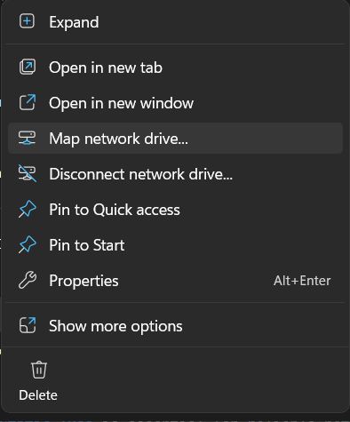
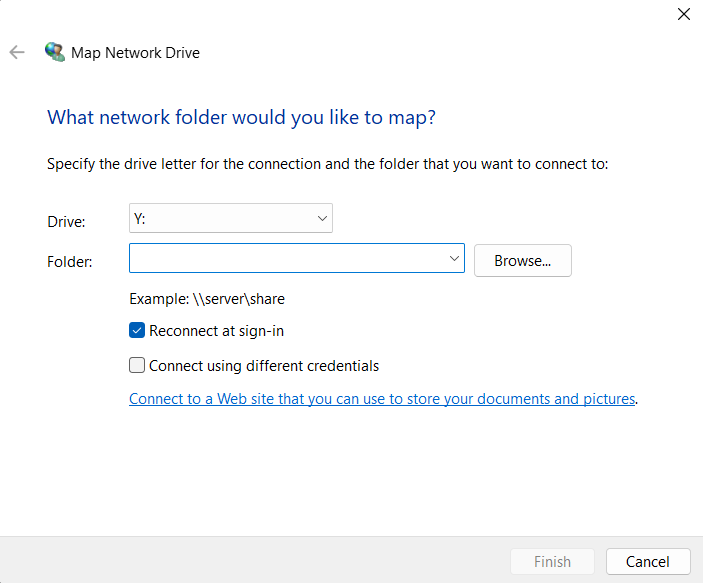
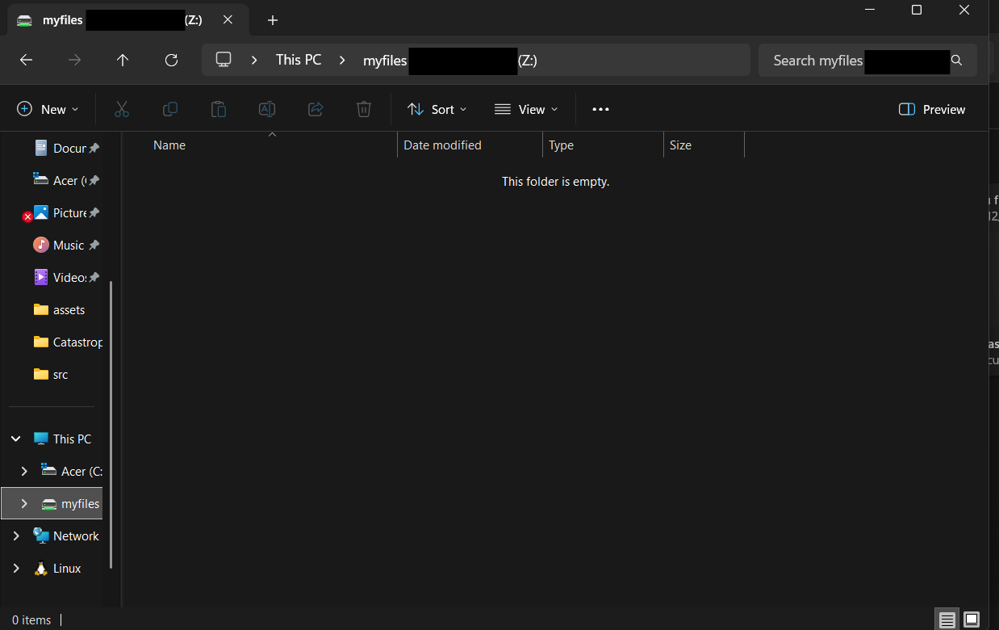
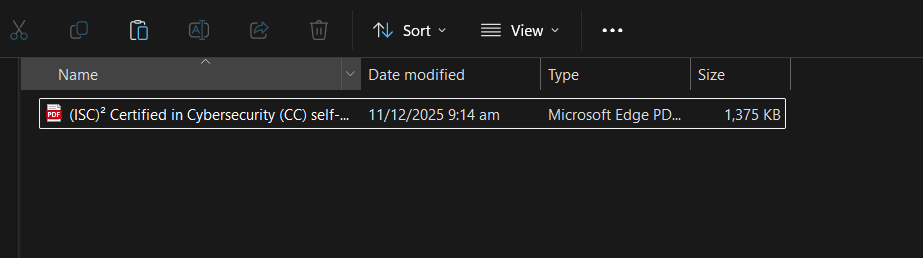
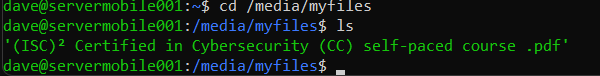

# Network Storage Server Configuration using Ubuntu Server

**Date:** December 22, 2025  
**Hardware:** Lenovo Ideapad 110-14IBR  
**Project Goal:** Convert my old laptop into a network storage server

**Guide Reference:** https://chriskalos.notion.site/The-0-Home-Server-Written-Guide-5d5ff30f9bdd4dfbb9ce68f0d914f1f6

**Additional Resources:** 
- https://youtu.be/K2m52F0S2w8
- https://youtu.be/NHTTlPvcC0M

**Assisted with:** Claude AI

---

## Overview

I transformed my old Lenovo Ideapad 110-14IBR into a 24/7 network storage server accessible to devices on my home network. The laptop previously had Kali Linux installed, but I decided to repurpose it as my personal network storage solution.

---

## Hardware Specifications

**Lenovo Ideapad 110-14IBR:**
- CPU: Intel Celeron N3060/N3160 or Pentium N3710
- RAM: Up to 8GB DDR3L (soldered)
- WiFi: 802.11ac
- **Critical Note:** This laptop has a 32-bit UEFI with a 64-bit CPU (requires bootia32.efi)

---

## 1. Creating the Bootable USB

### What I Used:
- Ubuntu Server 24.04 LTS ISO (64-bit)
- Rufus (Windows USB creator)
- 64GB USB drive

### Steps I Followed:
1. Created bootable USB with Rufus
2. Added Ubuntu Server ISO to the device
3. Started the process and waited until completion
4. Plugged the USB drive into my old laptop

---

## 2. BIOS Configuration

I accessed the BIOS by pressing **F12** repeatedly during startup.

### Settings I Changed:
- Boot Mode: Legacy → **UEFI**
- Secure Boot: **DISABLED**
- USB Boot: **ENABLED**
- Wireless LAN: **ENABLED**
- Saved and exited (F10)

---

## 3. Ubuntu Server Installation

1. Booted from USB (pressed F12 for boot menu)
2. Selected "Try or Install Ubuntu Server"
3. Followed the installer prompts:
   - Skipped network configuration (planned to configure later)
   - Skipped proxy address
   - Storage: Used entire disk, unchecked LVM (easier setup and I had nothing to backup)
   - **Enabled OpenSSH server** (to make it accessible from other devices)
   - Skipped featured snaps
4. Created my user account
5. Completed installation and rebooted

---

## 4. Post-Installation Configuration

### Disabling Lid Close Suspend

Since I wanted this to run 24/7 even with the lid closed, I needed to disable the suspend feature:

```bash
sudo nano /etc/systemd/logind.conf
```

I found and modified this line:
```
HandleLidSwitch=ignore
```

Saved (Ctrl+X, Y, Enter) and restarted the service:
```bash
sudo systemctl restart systemd-logind
```

---

## 5. WiFi Configuration

### The Challenge

I ran into a major roadblock: my WiFi was blocked by rfkill, but I couldn't install rfkill without internet access—a classic catch-22 situation!

### My Solution - Unblocking via sysfs

I discovered I could unblock WiFi directly through the sysfs filesystem:

```bash
# First, I found my WiFi interface name
ip link
# Found: wlp2s0

# Then I unblocked all rfkill devices
echo 0 | sudo tee /sys/class/rfkill/rfkill0/soft
echo 0 | sudo tee /sys/class/rfkill/rfkill1/soft
echo 0 | sudo tee /sys/class/rfkill/rfkill2/soft
echo 0 | sudo tee /sys/class/rfkill/rfkill3/soft

# Finally, I brought the WiFi interface up
sudo ip link set wlp2s0 up
```

### Configuring WiFi with Netplan

```bash
sudo nano /etc/netplan/50-cloud-init.yaml
```

I added this configuration:
```yaml
network:
  version: 2
  wifis:
    wlp2s0:
      dhcp4: true
      access-points:
        "WIFI SSID":
          password: "your-wifi-password"
      nameservers:
        addresses:
          - 8.8.8.8
```

I used 8.8.8.8 (google.com) as my connection checker. I could test it with `ping 8.8.8.8` or `ping google.com`.

Applied the configuration:
```bash
sudo netplan apply
```

Tested the connection:
```bash
ping google.com
```

### System Update

Once I was online, I updated everything:
```bash
sudo apt update
sudo apt upgrade -y
sudo apt install -y rfkill htop curl wget git
```

---

## 6. Static IP Configuration

I needed a static IP so I could SSH into the server consistently within my own network.

I disabled DHCP once I finished installing packages. Ideally, the IP address should be configured within the router to reduce problems, but since I don't know my router password, this was my workaround for now. (I'll definitely do this properly in the future!)

### Configuring Static IP

I edited netplan:
```bash
sudo nano /etc/netplan/50-cloud-init.yaml
```

Changed to static IP configuration:
```yaml
network:
  version: 2
  wifis:
    wlp2s0:
      dhcp4: false
      addresses:
        - [Your IP address]
      routes:
        - to: default
          via: [Your default gateway]
      nameservers:
        addresses:
          - 8.8.8.8
      access-points:
        "WIFI SSID":
          password: "your-wifi-password"
```

Applied and verified:
```bash
sudo netplan apply
ip a
ping google.com
```

**Reference:** https://youtu.be/NHTTlPvcC0M

---

## 7. SSH Configuration

### The Challenge: SSH Not Working from Remote Machines

I ran into an issue where SSH worked on localhost but failed when I tried to connect from other computers. The server was unreachable at first, so I had to configure it properly.

### Solutions I Applied:

1. **Regenerated SSH host keys:**
```bash
sudo ssh-keygen -A
```

2. **Fixed SSH configuration:**
```bash
sudo nano /etc/ssh/sshd_config
```

I ensured these settings were correct:
```
Port 22
PermitRootLogin no
PasswordAuthentication yes
```

3. **Restarted SSH service:**
```bash
sudo systemctl restart ssh
```

### Testing SSH Connection

From another computer:
```bash
ssh username@[IP address]
```

**Important Note:** I had to use my username, not `root`. Root login is disabled for security.

**Plot twist:** The real reason I couldn't use SSH initially was because I was using the wrong IP address. I found out that most of the time, I just entered the wrong numbers (it was late at night when I was doing this XD).

---

## 8. Samba Network Storage Setup

I used Samba for network storage, which allows network devices to connect from Windows, Linux, and macOS machines. This gives me extra storage space accessible from my laptop.

### Installing Samba

```bash
sudo apt update
sudo apt install samba
```

### Creating Shared Folder

```bash
sudo mkdir -p /media/myfiles
sudo chown $USER: /media/myfiles
```

### Configuring Samba

```bash
sudo nano /etc/samba/smb.conf
```

**I changed this line:**
```ini
map to guest = bad user
```

**To:**
```ini
map to guest = never
```

**Then I added this at the end of the file:**
```ini
[myfiles]
  path = /media/myfiles
  writeable=yes
  public=no
```

**Configuration details:**
- `myfiles` = Share name for network access
- `path` = Folder location on server
- `writeable=yes` = Allows file creation/editing
- `public=no` = Requires authentication

Saved (Ctrl+X, Y, Enter)

### Testing Configuration

```bash
testparm
```

I fixed any syntax errors that appeared.

### Setting Samba Password

For added security, I deployed a password:

```bash
sudo smbpasswd -a username
```

### Restarting Samba

```bash
sudo systemctl restart smbd
```

### Enabling Samba on Boot

```bash
sudo systemctl enable smbd
```

---

## 9. Troubleshooting & Fixes

### Issue: Samba Misconfiguration

**The Problem:** I misconfigured the smb.conf file during initial setup, which led me to problems. I tried reinstalling it, but I couldn't find the default config file.

**My Solution:** I reinstalled Samba completely to get a fresh default config:

```bash
# Removed Samba completely
sudo apt remove --purge samba samba-common -y
# To remove any files left 
sudo rm -rf /etc/samba/

# Reinstalled
sudo apt install samba
```

Then I reapplied the correct configuration as shown above.

---

## 10. Accessing Network Storage

### From Windows:

Since I use Windows (for now), this is what I did to add my server to my network.

**NOTE:** Make sure to open network discovery for it to work.

1. Opened File Explorer
2. In the address bar, typed: `\\[IP address]\myfiles`
3. Entered my credentials:
   - Username: `username`
   - Password: (Samba password I set)

   
   

---

## Key Learnings

Throughout this project, I learned several important lessons:

1. **rfkill blocking** can be bypassed using the sysfs method when the package isn't available
2. **SSH permissions** must be correct for remote access to work
3. **Static IP** is essential for reliable network storage access
4. **Samba reinstallation** is the fastest way to fix configuration errors XD
5. **Linux Commands** - I'm still unfamiliar with Linux, so this was good practice

---

## Quick Reference Commands

### Network:
```bash
ip a                          # Check IP address
ip route                      # Check gateway
sudo netplan apply            # Apply network changes
ping google.com               # Test internet
```

### SSH:
```bash
sudo systemctl status ssh     # Check SSH status
sudo systemctl restart ssh    # Restart SSH
ssh user@ip address      # Connect remotely
```

### Samba:
```bash
sudo systemctl status smbd    # Check Samba status
sudo systemctl restart smbd   # Restart Samba
testparm                      # Test configuration
```

## Status: ✅ Complete

**I successfully transformed my laptop into a network storage server!**





```bash
# To check if its working
cd /media/myfiles

# To see the list
ls

# It will return with
'(ISC)² Certified in Cybersecurity (CC) self-paced course .pdf' 
```

My old Lenovo Ideapad 110-14IBR is now serving as:
- Network-accessible file storage
- A 24/7 home server (as long as it is powered on or have electricity)
- Accessible from all devices on my home network
